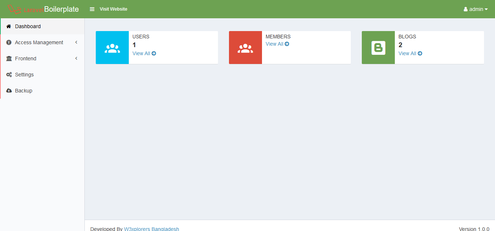
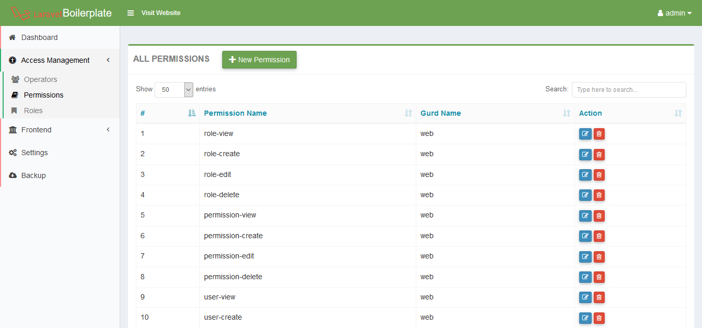
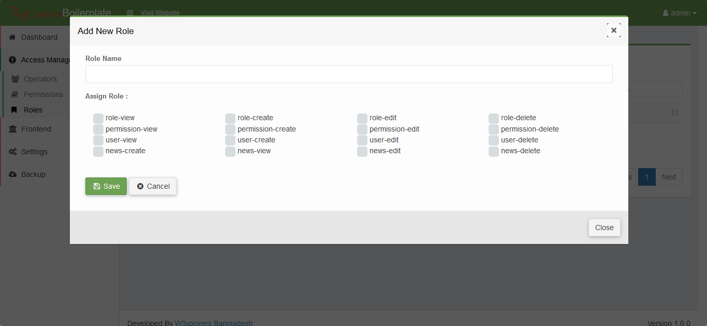
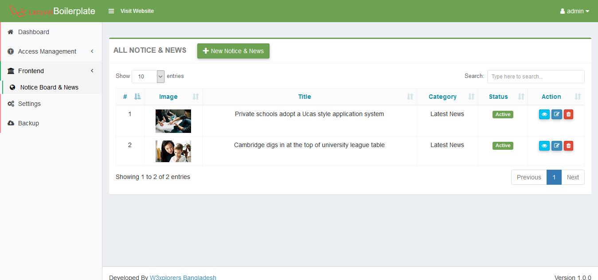
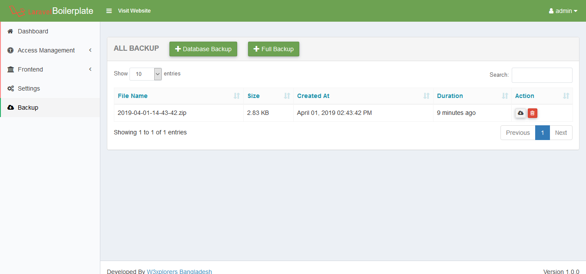

# Simple blog application using react js with laravel api

## Caracteristicas

    1. Laravel 5.8 Framework
    2. Laravel-Permission by spatie/laravel-permission
    3. Laravel Backup by spatie/laravel-backup
    4. Yajra Datatable by Yajra
    5. Laravel Ajax CRUD
    6. React js Fronend
    7. Axios
    8. React Pagination

### Requisitos

    1. PHP version upto 7.2    
    2. Laravel version  5.8   

### Instalación

    1. Clone the project using git clone   
    2. Copy a fresh .env file from laravel github    
    3. Update .env file by adding database information like DB_HOST.  
    4. Go to project root folder.Open git bash or terminal and run  composer install       
    5. Run php artisan key:generate in the terminal    
    6. Run php artisan migrate  
    7. npm install
    8. npm run dev
    
    
Screenshot : 

